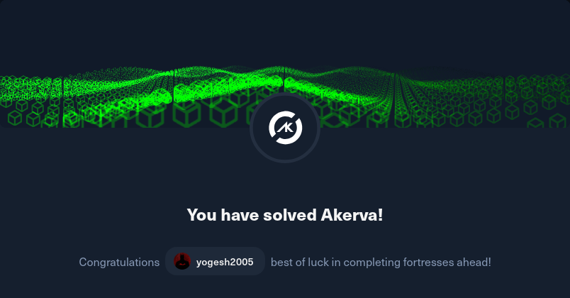

## Akerva Fortress – Conceptual Notes

**Topics Learned:**
- SNMP enumeration
- Fuzzing timestamped backups
- Flask development apps and LFI concepts
- Reverse shell basics
- Privilege escalation concepts
- Cipher decoding (Base64 + Vigenère)

**Key Learning Points:**
- Enumeration can reveal hidden services and internal scripts
- Backup files often expose source code and sensitive information
- Debug frameworks in development environments can introduce security risks
- Chaining multiple vulnerabilities is often required for full system compromise
- Basic cryptography knowledge helps in solving final challenge stages

**Skills Strengthened:**
- Web application enumeration
- Source code review
- Exploitation methodology
- Linux privilege escalation techniques
- Cryptography basics
