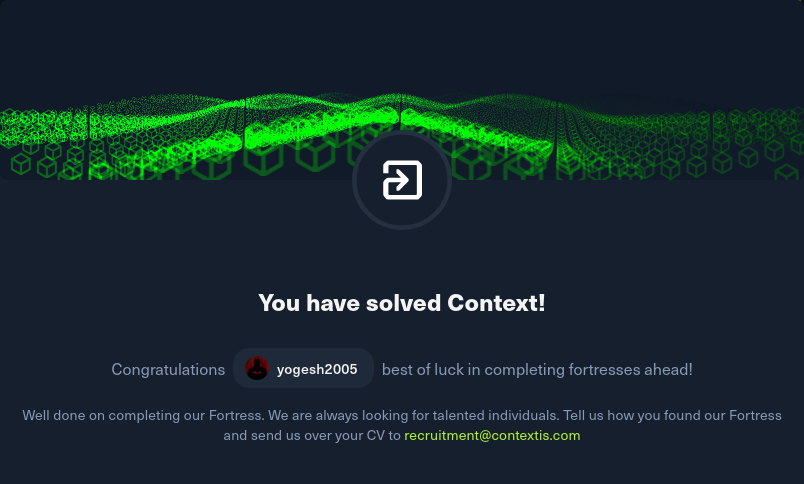

# Context - Conceptial Notes



---

### **Topics Learned:**

* Web enumeration on HTTPS services
* Source code analysis for credential leakage
* SQL Injection (MSSQL – subquery & concatenation)
* Outlook Web Access (OWA) exploitation
* Credential pivoting across services
* MSSQL lateral movement using `openquery`
* .NET deserialization exploitation
* Reverse shell payload generation (msfvenom)
* Windows post-exploitation (Evil-WinRM)
* Binary analysis & decompilation

---

### **Key Learning Points:**

* Sensitive data in source code can directly expose credentials and flags
* SQL Injection in MSSQL can be extended using subqueries and concatenation
* Email access (OWA) can lead to internal file discovery and further compromise
* Serialized cookies can be abused for remote code execution
* MSSQL linked servers enable lateral movement via `openquery`
* Large database dumps often hide important secrets—manual searching is crucial
* Base64 encoded blobs in databases may contain executables or DLLs
* Credential reuse is a powerful attack vector across services
* Decompiling binaries can reveal hidden credentials and flags

---

### **Skills Strengthened:**

* Manual web enumeration & source code review
* Advanced SQL Injection (MSSQL-specific techniques)
* Credential harvesting and reuse
* MSSQL exploitation with Impacket tools
* Deserialization attack crafting (ysoserial)
* Reverse shell generation & troubleshooting
* Windows remote access via Evil-WinRM
* Binary reverse engineering basics
* Data extraction and analysis from large outputs

---

## Attack Chain Summary

```
Initial Access
│
├─ HTTPS (443) → Website discovered
│   └─ Source code review → Credentials + Flag 1
│
├─ Login Endpoint Identified
│   └─ SQL Injection (MSSQL - subquery concat)
│       └─ Extracted creds → Flag 2 (DB)
│
├─ Outlook Web Access (/owa/auth/logon.aspx)
│   └─ Login using creds
│       └─ Access other mailboxes
│           └─ Found Flag 3
│           └─ Found ZIP file (Jeff mail)
│
├─ Extracted ZIP → ViewState.cshtml
│   └─ Serialized cookie identified
│       └─ ysoserial + msfvenom payload
│           └─ Reverse shell → Flag 4
│
├─ Log Analysis
│   └─ Search: "TEIGNTON"
│       └─ Found creds: karlmemaybe
│
├─ Outlook Login (Karl)
│   └─ Karl has MSSQL privileges
│       └─ Connect using impacket-mssqlclient
│
├─ MSSQL Enumeration
│   └─ Linked servers discovered
│       └─ openquery used (lateral movement)
│           └─ Dump large database
│               └─ Search "CONTENT" → Flag 5
│
├─ sys.assembly_files
│   └─ Extract base64 blob
│       └─ Decode → DLL
│           └─ Found creds: jay.teignton
│
├─ Evil-WinRM Access
│   └─ Login as jay.teignton
│       └─ Admin privileges
│           └─ Found EXE file
│               └─ Download & decompile
│                   └─ Extract hex → Flag 6
│
└─ Final Step
    └─ Administrator access
        └─ Read final/root flag
```
