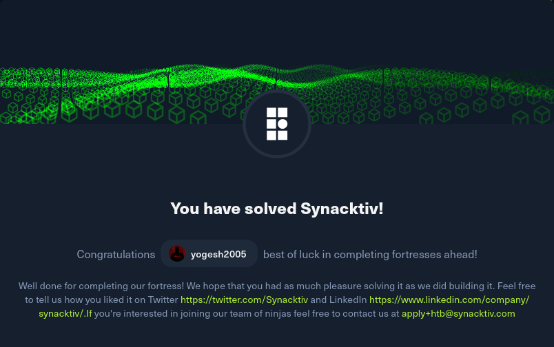

## Synacktiv Fortress – Conceptual Notes



---

### **Topics Learned:**

* Web enumeration & virtual host discovery
* Symfony framework exploitation
* Signed URL abuse & authentication bypass
* Java deserialization (RMI-based exploitation)
* Docker/container lateral movement
* Internal network reconnaissance
* Proxy pivoting (Squid → SSH tunneling)
* Mobile APK analysis & OTP bypass
* Linux privilege escalation techniques
* Sudo misconfiguration abuse
* Kernel exploitation (PwnKit – CVE-2021-4034)

---

### **Key Learning Points:**

* Virtual host fuzzing can reveal hidden environments like dev instances
* Debug tokens and framework misconfigurations (Symfony) can expose sensitive functionality
* Improperly protected signing keys allow forging authenticated requests
* Java deserialization vulnerabilities can directly lead to remote code execution
* Monitoring services (like RMI clients) can be abused for lateral movement
* Internal network enumeration is critical after gaining initial access
* Proxy services (e.g., Squid) can be leveraged to access otherwise unreachable internal services
* Mobile apps can leak authentication logic such as OTP generation
* Simple tools like `less` can be abused for shell escapes
* Misconfigured sudo binaries can open paths for privilege escalation
* Kernel exploits like **PwnKit** can provide instant root access if unpatched

---

### **Skills Strengthened:**

* Advanced web fuzzing (vhosts, endpoints, framework artifacts)
* Exploiting signed URLs and authentication logic flaws
* Java deserialization attack crafting
* Internal network scanning and pivoting techniques
* Proxy chaining and SSH tunneling
* Mobile application analysis (APK reverse engineering)
* Reverse shell handling and stabilization
* Linux privilege escalation (user → root)
* Exploit usage (searchsploit, manual deployment)

---

### **Attack Chain Summary**

```
Initial Access
│
├─ Web Enumeration (HTTP)
│   └─ VHost fuzzing → dev subdomain
│       └─ Symfony debug token discovered
│
├─ Auth Bypass → Signed URL
│   └─ Production key abuse
│       └─ RCE → FLAG 1
│
├─ Docker Environment
│   └─ Found .tar + cronjob activity (pspy64)
│       └─ Leads to internal service interaction
│
├─ Java RMI Exploitation
│   └─ monitoring-client.jar
│       └─ Deserialization attack → RCE shell
│
├─ Internal Recon
│   └─ Scan 172.22.1.0/24
│       └─ Found scripts → FLAG 3
│
├─ Mobile App Analysis
│   └─ Extract OTP logic
│       └─ MFA bypass
│
├─ Network Pivoting
│   └─ Squid Proxy (3128)
│       └─ SSH pivot to internal host → FLAG 4
│
├─ User Priv Esc
│   └─ less escape (! command)
│       └─ Reverse shell → FLAG 5
│
├─ Sudo Misconfiguration
│   └─ admin-backup binary
│
├─ Kernel Exploit
│   └─ CVE-2021-4034 (PwnKit)
│       └─ ROOT ACCESS
│
└─ Final
    └─ Read flags → FLAG 6 & FLAG 7
```


